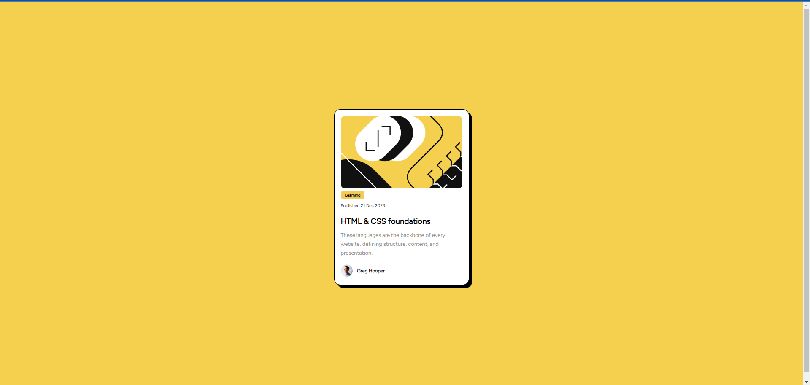

# Frontend Mentor - Blog preview card solution

This is a solution to the [Blog preview card challenge on Frontend Mentor](https://www.frontendmentor.io/challenges/blog-preview-card-ckPaj01IcS). Frontend Mentor challenges help you improve your coding skills by building realistic projects. 

## Table of contents

- [Overview](#overview)
  - [The challenge](#the-challenge)
  - [Screenshot](#screenshot)
  - [Links](#links)
- [My process](#my-process)
  - [Built with](#built-with)
- [Author](#author)

**Note: Delete this note and update the table of contents based on what sections you keep.**

## Overview

### The challenge       

Users should be able to:

- See hover and focus states for all interactive elements on the page

### Screenshot

### Links

- Solution URL: [https://github.com/barka-dev/blog-preview-card.git](https://your-solution-url.com)
- Live Site URL: [https://barka-dev.github.io/blog-preview-card/](https://your-live-site-url.com)

### Built with

- Semantic HTML5 markup
- CSS custom properties
- Flexbox
- Media query

## Author

- Website - [Abdessalam Barka](https://www.your-site.com)
- Frontend Mentor - [@barka-dev](https://www.frontendmentor.io/profile/barka-dev)
- Twitter - [@AbdessalamBarka](https://www.twitter.com/yourusername)

